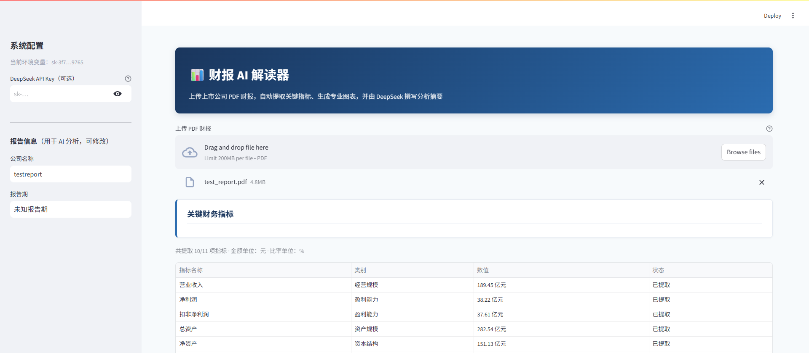

# 财报 AI 解读器

用 Python + Streamlit 搭建的财报解读 Web 应用：上传 PDF → 提取关键财务指标 → Plotly 可视化 → DeepSeek 生成分析摘要与风险提示，并支持多份报告对比。

## 功能概览

1. 上传 PDF 格式公司财报
2. 自动提取营收、净利润、ROE、毛利率、资产负债率等指标
3. Plotly 图表：营收趋势、利润构成、财务比率雷达图
4. 调用 DeepSeek（OpenAI 兼容接口）生成 AI 摘要与风险提示



## 项目结构

```
financial-report-ai/
├── app.py                 # Streamlit 主程序入口
├── requirements.txt       # 依赖列表
├── .env.example           # 环境变量示例（复制为 .env）
├── README.md
└── modules/
    ├── __init__.py
    ├── pdf_parser.py      # PDF 文本/表格提取（pdfplumber）
    ├── metrics.py         # 财务指标提取
    ├── charts.py          # Plotly 图表
    └── ai_analyzer.py     # DeepSeek AI 分析
```

## 环境要求

- Python 3.8+（本机已验证可用 3.8.5）
- DeepSeek API Key（[平台申请](https://platform.deepseek.com/)）

## 快速开始

### 1. 安装依赖

```bash
cd financial-report-ai
pip install -r requirements.txt
```

### 2. 配置 API Key

方式 A：环境变量（推荐本地开发）

```bash
# Windows PowerShell
copy .env.example .env
# 然后用编辑器打开 .env，填入真实的 DEEPSEEK_API_KEY
```

方式 B：Streamlit secrets

在项目下创建 `.streamlit/secrets.toml`：

```toml
DEEPSEEK_API_KEY = "sk-your-api-key-here"
DEEPSEEK_BASE_URL = "https://api.deepseek.com"
DEEPSEEK_MODEL = "deepseek-chat"
```

### 3. 启动应用

```bash
streamlit run app.py
```

浏览器会自动打开本地页面（默认 `http://localhost:8501`）。

## 使用说明

1. 左侧上传一份 PDF 财报，点击「开始解析」
2. 在「财务指标」页查看提取结果
3. 在「可视化图表」页查看趋势、构成与雷达图
4. 在「AI 分析」页选择报告并生成解读

## 注意事项

- 当前指标提取为基于关键词的简化规则，不同公司财报表述差异大，后续可结合表格解析与更精细规则提高准确率
- 请勿将真实 API Key 提交到公开仓库；`.env` 应加入 `.gitignore`
- AI 分析结果仅供学习参考，不构成投资建议

## 计划完善方向

- 增加一次性上传多份PDF，进行多份财报指标对比、行业基准分析等
- 增强 PDF 表格解析与指标单位换算（元 / 万元 / 亿元）
- 按年份自动排序对比
- 导出分析报告（ Word / PDF）
- 缓存解析结果，避免重复上传耗时
